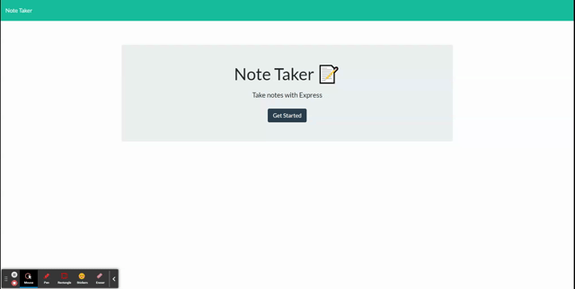

# NOTE TAKER

This web application can be used to write, save, and delete notes.

The following image demonstrates the application functionality:

## Deployed link

[Note Taker](https://the-notetaker.herokuapp.com/)

## Prerequisites

This software can be used on :

- Google Chrome
- Microsoft Edge
- Firefox
  It hasn't been tested on other browsers but it might works properly.

## Author

- [@carlastjuste](http://github.com/carlastjuste)

## License

This project is licensed under the MIT License - see the LICENSE.md file for details

---

© 2021 Carla ST JUSTE, All Rights Reserved.
